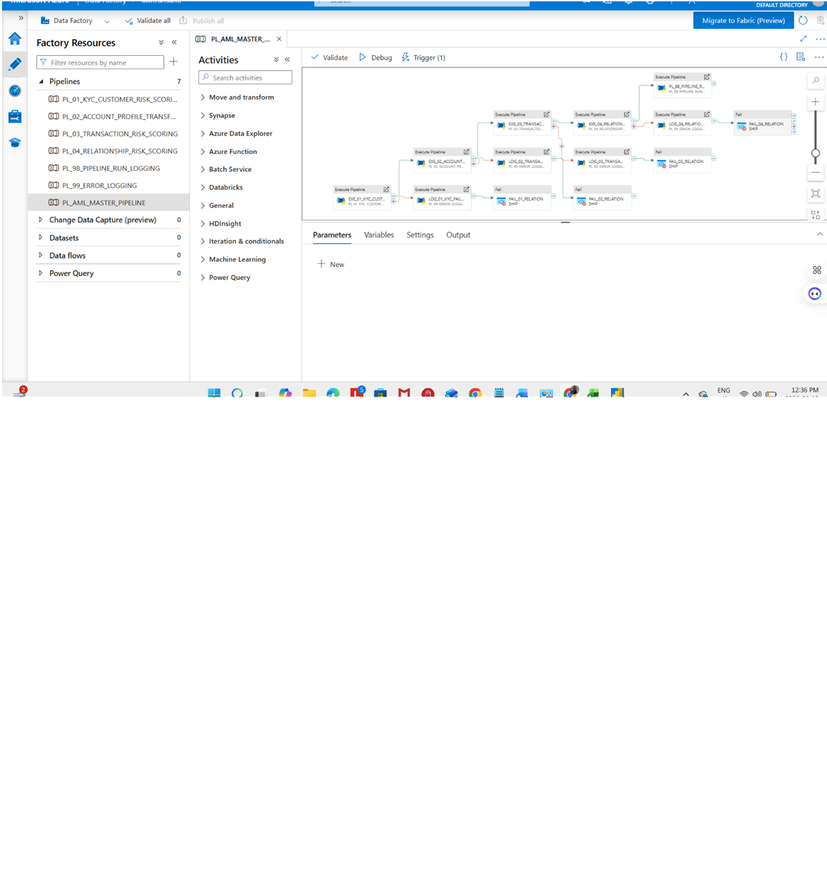
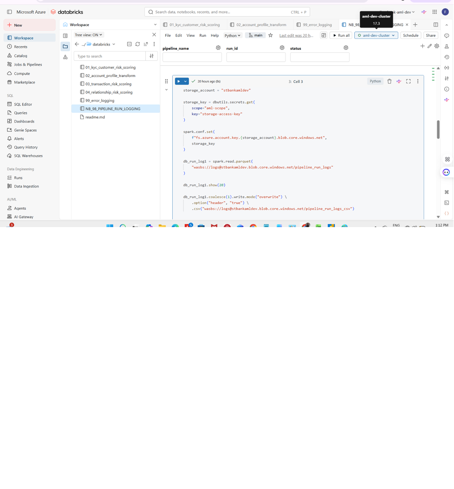
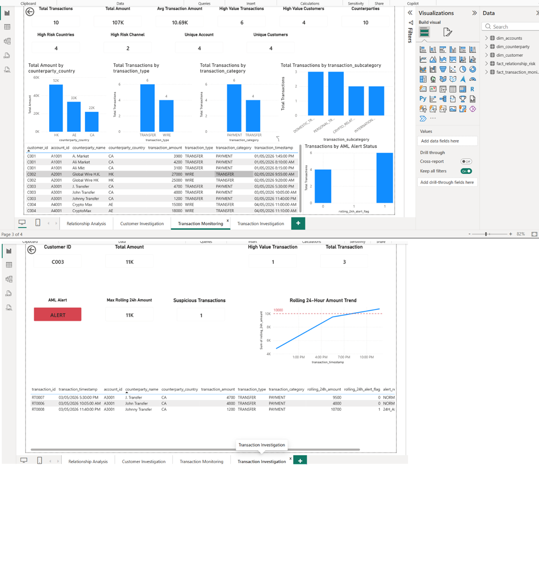

# AML Pipeline Monitoring Solution

## Overview

This project demonstrates an end-to-end AML monitoring solution built using Azure Data Factory, Azure Databricks, Azure Storage and Power BI.
Credentials and secrets are managed through Databricks Secret Scope.
No secrets or access keys are stored in source code.

## Architecture

ADF
→ Databricks
→ Azure Storage
→ Power BI

## Components

### Azure Data Factory

- Master Pipeline Orchestration
- Pipeline Run Logging
- Error Logging
- Dependency Management

### Azure Databricks

- AML Data Processing
- Pipeline Run Logging Notebook
- Error Logging Notebook

### Azure Storage

- pipeline_run_logs
- error_logs

### Power BI Dashboards

- AML Monitoring Dashboard
- KYC Dashboard
- Transaction Monitoring Dashboard
- Relationship Analysis Dashboard

## Screenshots

### ADF Master Pipeline

### Azure Storage Logs

### Databricks Logging Notebook

### AML Monitoring Dashboard

### KYC Dashboard

### Transaction Monitoring Dashboard

### Relationship Analysis Dashboard

## Technology Stack

- Azure Data Factory
- Azure Databricks
- PySpark
- Azure Blob Storage
- Power BI
- GitHub

## Key Features

- Pipeline Monitoring
- Error Tracking
- AML Data Processing
- KYC Risk Assessment
- Transaction Monitoring
- Relationship Risk Analysis
- Operational Reporting
